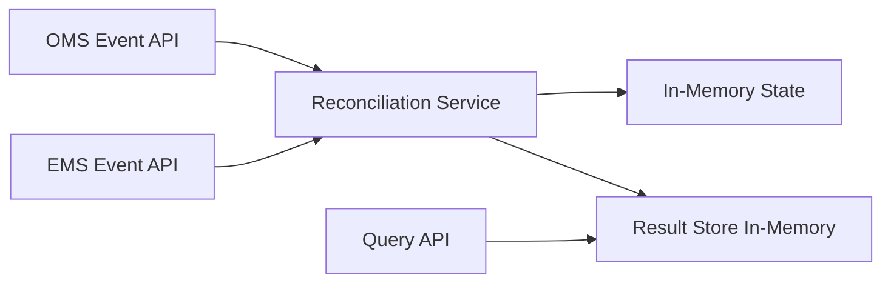
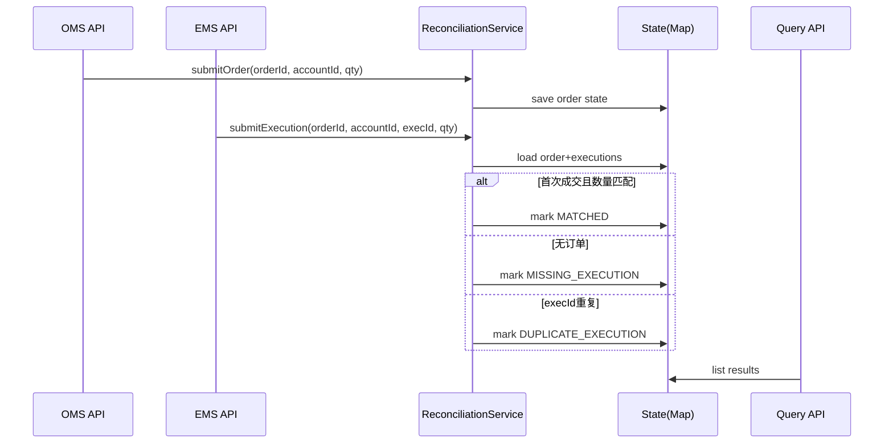
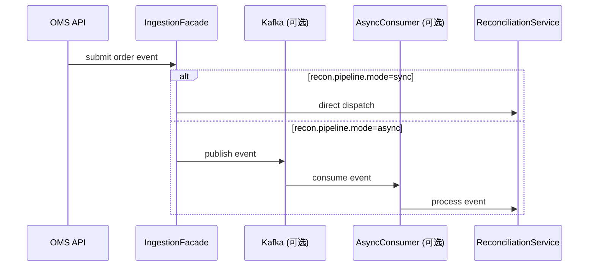

# Java POC 设计方案（轻量版）：订单-成交对账核心流程

> 目标：只做“最小可运行核心链路”，在 **3~5 小时** 内可完成并演示。

## 1. 业务目标（聚焦版）

在交易系统中，OMS（订单）与 EMS（成交）常见的核心问题是：
- 订单有记录但无成交回报（漏回）
- 同一成交被重复推送（重复）

本 POC 仅解决这 2 类高价值问题，不扩展复杂告警平台、规则引擎或流式中间件。

**POC 成功标准：**
1. 接收 OMS/EMS 两类事件；
2. 以 `orderId + accountId` 对账；
3. 输出 3 种结果：`MATCHED / MISSING_EXECUTION / DUPLICATE_EXECUTION`；
4. 提供一个查询接口查看结果。

---

## 2. 范围剪枝（明确不做）

### 本次做
- 单体 Spring Boot 服务
- 内存存储（`ConcurrentHashMap`）
- REST 输入 + REST 查询
- 单线程/小并发可运行

### 本次不做（但保留后续扩展入口）
- Kafka、Disruptor、Watermark、复杂窗口
- 多级规则引擎
- 分布式事务、消息重试平台
- 复杂权限系统

> 面试强调“轻量化”，先把核心业务闭环做扎实，再口头说明可扩展方向。

---

## 3. 轻量架构图（当前实现）



### 组件说明
- `OMS Event API`：接收订单事件。
- `EMS Event API`：接收成交事件。
- `Reconciliation Service`：核心匹配逻辑（唯一核心）。
- `In-Memory State`：保存订单/成交聚合状态。
- `Query API`：返回对账结果列表。

---

## 4. 扩展架构图（预留入口，不在本次实现）

> 下图用于指导后续“参数开关/适配器”演进。标记为 `(可选)` 的组件在当前 POC 中不实现，仅预留接口。

```mermaid
flowchart LR
    OA[OMS API] --> IN[Ingestion Facade]
    EA[EMS API] --> IN

    IN --> V[Validator Chain (可选)]
    V --> ROUTER[Dispatch Strategy]

    ROUTER -->|sync=true| CORE[Reconciliation Service]
    ROUTER -->|async=true| KAFKA[(Kafka Topic (可选))]
    KAFKA --> CONSUMER[Async Consumer (可选)]
    CONSUMER --> CORE

    CORE --> STORE[(State Store)]
    CORE --> RESULT[(Result Store)]

    CORE --> RULES[Rule Engine Adapter (可选)]
    CORE --> RETRY[Retry/DLQ Adapter (可选)]

    Q[Query API] --> RESULT

    subgraph Feature Toggle / Config
      CFG1[recon.pipeline.mode = sync|async]
      CFG2[recon.validation.enabled = true|false]
      CFG3[recon.ruleEngine.enabled = true|false]
      CFG4[recon.retry.enabled = true|false]
    end

    CFG1 -.-> ROUTER
    CFG2 -.-> V
    CFG3 -.-> RULES
    CFG4 -.-> RETRY
```

### 4.1 设计意图（本次先不写代码）
- **策略模式（Dispatch Strategy）**：根据配置决定走同步直连服务，还是异步 Kafka 通道。
- **适配器模式（Adapter）**：
  - `Rule Engine Adapter`：后续可接 Drools/自研规则服务；
  - `Retry/DLQ Adapter`：后续可接消息重试与死信处理。
- **验证链（Validator Chain）**：把字段校验、业务校验拆成可插拔链路。

### 4.2 建议预留配置键（后续实现）
- `recon.pipeline.mode=sync`（默认）
- `recon.validation.enabled=false`
- `recon.ruleEngine.enabled=false`
- `recon.retry.enabled=false`
- `recon.kafka.topic.orders=oms-events`
- `recon.kafka.topic.execs=ems-events`

---

## 5. 核心流程图（当前主线）



---

## 6. 核心流程图（扩展异步版，后续）



---

## 7. 最小领域模型

```text
OrderEvent
- orderId
- accountId
- quantity
- eventTime

ExecutionEvent
- execId
- orderId
- accountId
- quantity
- eventTime

ReconciliationResult
- accountId
- orderId
- status: MATCHED | MISSING_EXECUTION | DUPLICATE_EXECUTION
- message
- updatedAt
```

---

## 8. 代码结构（当前实现 + 预留扩展位）

```text
src/main/java/com/acme/recon/
├─ ReconciliationApplication.java
├─ controller/
│  ├─ OmsController.java
│  ├─ EmsController.java
│  └─ QueryController.java
├─ service/
│  └─ ReconciliationService.java
├─ model/
│  ├─ OrderEvent.java
│  ├─ ExecutionEvent.java
│  └─ ReconciliationResult.java
├─ repository/
│  └─ InMemoryReconciliationRepository.java
└─ extension/                    # 预留，不在本次实现
   ├─ dispatch/
   │  ├─ DispatchStrategy.java
   │  ├─ SyncDispatchStrategy.java
   │  └─ KafkaDispatchStrategy.java
   ├─ validation/
   │  ├─ Validator.java
   │  └─ ValidatorChain.java
   ├─ rule/
   │  └─ RuleEngineAdapter.java
   └─ retry/
      └─ RetryAdapter.java
```

---

## 9. API 设计（最小集合）

- `POST /api/oms/events`
- `POST /api/ems/events`
- `GET /api/reconciliation/results`

示例验收：
1. 先发 OMS 订单；
2. 发一次 EMS 成交 -> `MATCHED`；
3. 再重复发同一个 `execId` -> `DUPLICATE_EXECUTION`。

---

## 10. Docker 与运行（轻量）

- 单个 `Dockerfile` 即可；`docker-compose.yml` 可选。
- 启动命令：`mvn spring-boot:run` 或 `docker run ...`

---

## 11. 下一步改代码建议（按优先级）

1. 先加 `DispatchStrategy` 接口与 `sync` 默认实现（不引入 Kafka 依赖）。
2. 增加 `@ConfigurationProperties` 读取 `recon.pipeline.mode`。
3. 再补 `KafkaDispatchStrategy` 空实现（方法体可 TODO）。
4. 最后再把 `ValidatorChain` / `RuleEngineAdapter` / `RetryAdapter` 以开关接入。

这样能做到：
- **本次可跑**（核心闭环不受影响）
- **后续可扩**（接口和开关已就位）
- **面试可讲**（清楚的演进路线）
