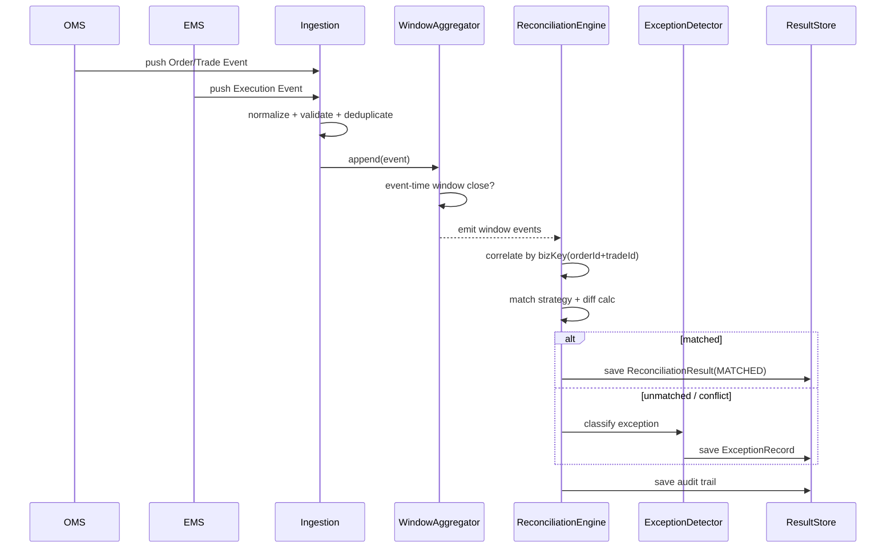

# Java POC 设计方案：实时交易对账与异常检测模块

## 1. POC 定位

### 1.1 业务背景（脱敏）
在券商/资管场景中，订单系统（OMS）与成交回报系统（EMS）之间可能出现：
- 成交漏回（某笔成交在 OMS 中存在，在 EMS 中缺失）
- 重复回报（同一成交被重复推送）
- 状态不一致（订单状态与成交状态冲突）

真实生产环境通常规模大、系统耦合深，不适合面试短时交付。因此 POC 只抽取“**核心对账与异常检测链路**”，用小而完整的工程体现架构能力。

### 1.2 业务目标
构建一个可独立运行的 Java 模块，实现：
1. 按时间窗口聚合 OMS 与 EMS 事件；
2. 自动匹配并产出对账结果；
3. 识别异常并分级告警；
4. 输出审计日志和可回放结果。

---

## 2. 核心技术挑战与应对

| 技术挑战 | 方案 | 体现能力 |
|---|---|---|
| 高频并发事件处理 | Disruptor/RingBuffer（POC 可先用 BlockingQueue，再可插拔升级） | 并发模型设计与可演进性 |
| 乱序与延迟到达 | Event-Time + Watermark + 延迟容忍窗口 | 数据一致性与时序处理 |
| 匹配策略复杂 | 策略模式（TradeMatchStrategy）+ 规则链（RuleChain） | 设计模式落地 |
| 异常检测与扩展 | 责任链 + 规则引擎接口化 | 业务规则可扩展 |
| 可追溯性 | Event Sourcing 风格审计流 + 幂等键 | 可观测与审计合规 |

---

## 3. 总体架构图（组件视图）

```mermaid
flowchart LR
    A[OMS Event Source] --> C[Ingestion Adapter]
    B[EMS Event Source] --> C
    C --> D[Normalizer & Validator]
    D --> E[Event Buffer / Stream]
    E --> F[Window Aggregator\n(Event-Time + Watermark)]
    F --> G[Reconciliation Engine]
    G --> H[Exception Detector]
    H --> I[Alert Publisher]
    G --> J[Reconciliation Result Store]
    H --> K[Exception Store]
    D --> L[Audit Log]
    G --> L
    H --> L

    subgraph API
      M[REST Query API]
    end

    M --> J
    M --> K
```

### 3.1 分层说明
- **接入层（Adapter）**：接收 OMS/EMS 事件（HTTP/Kafka/mock 文件）。
- **标准化层（Normalizer）**：统一字段、时区、金额精度、业务主键。
- **对账核心层（Engine）**：窗口聚合、匹配、差异计算、异常分类。
- **输出层（Store + API）**：持久化结果并提供查询。
- **横切能力**：审计日志、幂等、监控指标、追踪。

---

## 4. 时序流程图（核心处理流程）



---

## 5. 关键领域模型

### 5.1 输入事件
- `OrderEvent`：订单侧事件（订单号、账户、标的、方向、委托量、委托价、时间戳）
- `ExecutionEvent`：成交侧事件（成交号、关联订单号、成交量、成交价、成交时间）

### 5.2 输出对象
- `ReconciliationResult`：`MATCHED/PARTIAL/UNMATCHED/CONFLICT`
- `ExceptionRecord`：异常类型、严重级别、规则命中、修复建议、上下文快照
- `AuditRecord`：事件处理轨迹（接收->标准化->匹配->输出）

### 5.3 主键与幂等
- 业务主键：`accountId + orderId + tradeId(optional)`
- 幂等键：`source + sourceEventId + eventVersion`

---

## 6. 设计模式与架构决策

1. **策略模式（Strategy）**：
    - `TradeMatchStrategy` 支持“严格匹配”“容差匹配（价格/数量容差）”。
2. **责任链模式（Chain of Responsibility）**：
    - 异常规则链（漏单、重复、金额偏差、时间偏差、状态冲突）。
3. **模板方法（Template Method）**：
    - 标准化流程固定，字段映射细节由渠道 Adapter 覆盖。
4. **端口适配器（Hexagonal）**：
    - 对账核心不依赖外部中间件，便于单测和替换实现。

### 6.1 Trade-offs
- **POC 轻量化**：优先内存存储 + H2，降低部署复杂度；
- **工程可扩展**：接口先行，可平滑替换到 Kafka + PostgreSQL；
- **一致性优先**：先保证可解释性与审计，再做极致性能。

---

## 7. 建议技术栈（Java）

- Java 21
- Spring Boot 3.x（REST + DI + Actuator）
- Gradle
- H2（POC）/ PostgreSQL（可选）
- Micrometer + Prometheus（指标）
- Testcontainers（集成测试，可选）

---

## 8. 代码与文档结构（建议）

```text
poc-reconciliation/
├─ src/main/java/com/acme/recon/
│  ├─ app/
│  │  ├─ ReconciliationApplication.java
│  │  └─ config/
│  ├─ domain/
│  │  ├─ model/
│  │  │  ├─ OrderEvent.java
│  │  │  ├─ ExecutionEvent.java
│  │  │  ├─ ReconciliationResult.java
│  │  │  └─ ExceptionRecord.java
│  │  ├─ service/
│  │  │  ├─ ReconciliationService.java
│  │  │  ├─ WindowAggregationService.java
│  │  │  └─ ExceptionDetectionService.java
│  │  ├─ strategy/
│  │  │  ├─ TradeMatchStrategy.java
│  │  │  ├─ StrictMatchStrategy.java
│  │  │  └─ ToleranceMatchStrategy.java
│  │  └─ rule/
│  │     ├─ ExceptionRule.java
│  │     ├─ MissingTradeRule.java
│  │     └─ DuplicateTradeRule.java
│  ├─ infrastructure/
│  │  ├─ adapter/
│  │  │  ├─ inbound/
│  │  │  │  ├─ OmsWebhookController.java
│  │  │  │  ├─ EmsWebhookController.java
│  │  │  │  └─ QueryController.java
│  │  │  └─ outbound/
│  │  │     ├─ H2ReconciliationRepository.java
│  │  │     └─ InMemoryAuditRepository.java
│  │  └─ messaging/
│  │     └─ LocalEventBus.java
│  └─ shared/
│     ├─ IdempotencyService.java
│     ├─ JsonUtil.java
│     └─ ClockProvider.java
├─ src/test/java/com/acme/recon/
│  ├─ unit/
│  └─ integration/
├─ docs/
│  ├─ 01-business-context.md
│  ├─ 02-architecture-decisions.md
│  ├─ 03-validation-guide.md
│  └─ 04-ai-collaboration-note.md
├─ Dockerfile
├─ docker-compose.yml
├─ README.md
└─ build.gradle
```

---

## 9. 验证路径（面试官可快速验收）

1. 启动：`docker-compose up --build`
2. 发送样例 OMS/EMS 事件（提供脚本）
3. 查询 `/api/reconciliation/results`：应看到 matched/unmatched
4. 查询 `/api/reconciliation/exceptions`：应看到异常分级
5. 查看 `/actuator/metrics`：处理吞吐与延迟指标

---

## 10. README（建议章节模板）

1. **业务与技术背景**：原系统痛点、POC 抽象边界
2. **架构决策**：为何选该方案、替代方案、权衡
3. **AI 协作说明**：
    - AI 用于：初版脚手架、规则类模板、测试数据生成
    - 人工修正：并发边界、幂等键设计、异常分级规则
4. **验证指南**：启动、调用、预期输出、常见问题
5. **后续演进**：Kafka 化、规则 DSL 化、分布式扩展

---

## 11. 面试展示建议（10~15 分钟）

- 2 分钟：业务问题与为什么抽象这个模块
- 4 分钟：架构图 + 关键流程
- 4 分钟：技术挑战（并发/乱序/幂等/规则扩展）
- 3 分钟：演示接口与异常检测结果
- 2 分钟：Trade-offs 与后续路线

