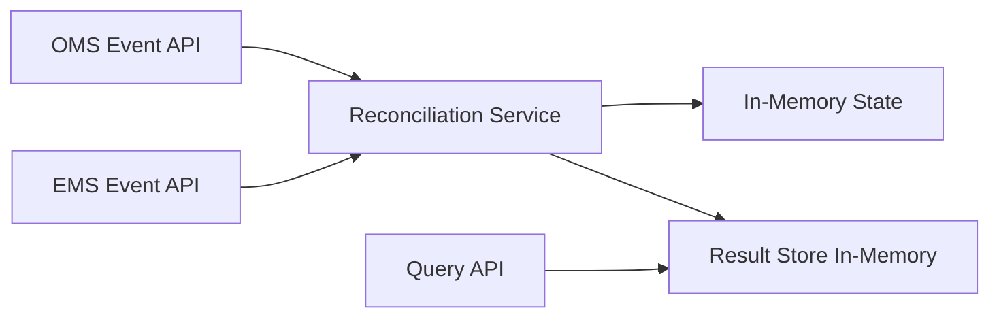
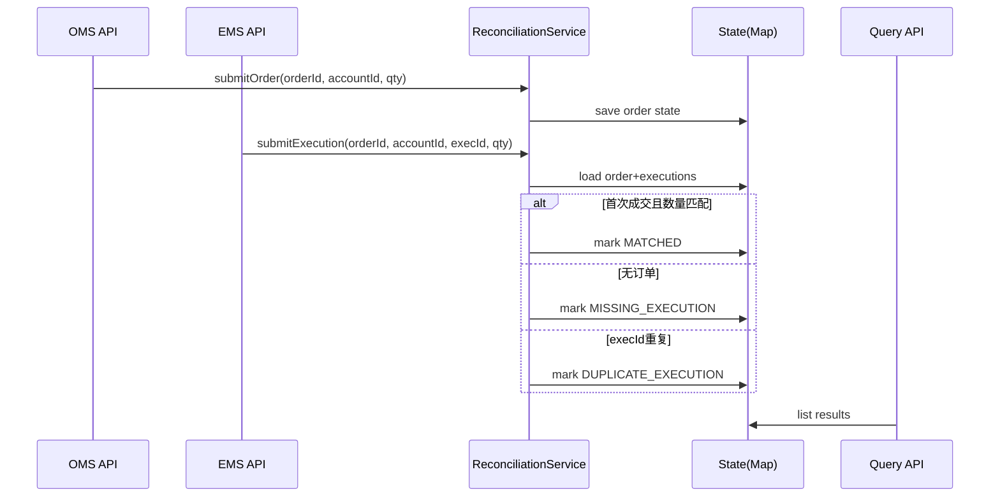

# Java POC 设计方案（轻量版）：订单-成交对账核心流程

> 目标：只做“最小可运行核心链路”，在 **3~5 小时** 内可完成并演示。

## 1. 业务目标（聚焦版）

在交易系统中，OMS（订单）与 EMS（成交）常见的核心问题是：
- 订单有记录但无成交回报（漏回）
- 同一成交被重复推送（重复）

本 POC 仅解决这 2 类高价值问题，不扩展复杂告警平台、规则引擎或流式中间件。

**POC 成功标准：**
1. 接收 OMS/EMS 两类事件；
2. 以 `orderId + accountId` 对账；
3. 输出 3 种结果：`MATCHED / MISSING_EXECUTION / DUPLICATE_EXECUTION`；
4. 提供一个查询接口查看结果。

---

## 2. 范围剪枝（明确不做）

### 本次做
- 单体 Spring Boot 服务
- 内存存储（`ConcurrentHashMap`）
- REST 输入 + REST 查询
- 单线程/小并发可运行

### 本次不做
- Kafka、Disruptor、Watermark、复杂窗口
- 多级规则引擎
- 分布式事务、消息重试平台
- 复杂权限系统

> 面试强调“轻量化”，先把核心业务闭环做扎实，再口头说明可扩展方向。

---

## 3. 轻量架构图



### 组件说明
- `OMS Event API`：接收订单事件。
- `EMS Event API`：接收成交事件。
- `Reconciliation Service`：核心匹配逻辑（唯一核心）。
- `In-Memory State`：保存订单/成交聚合状态。
- `Query API`：返回对账结果列表。

---

## 4. 核心流程图（只保留主线）



---

## 5. 最小领域模型

```text
OrderEvent
- orderId
- accountId
- quantity
- eventTime

ExecutionEvent
- execId
- orderId
- accountId
- quantity
- eventTime

ReconciliationResult
- accountId
- orderId
- status: MATCHED | MISSING_EXECUTION | DUPLICATE_EXECUTION
- message
- updatedAt
```

---

## 6. 代码结构（可在几小时内落地）

```text
src/main/java/com/acme/recon/
├─ ReconciliationApplication.java
├─ controller/
│  ├─ OmsController.java
│  ├─ EmsController.java
│  └─ QueryController.java
├─ service/
│  └─ ReconciliationService.java
├─ model/
│  ├─ OrderEvent.java
│  ├─ ExecutionEvent.java
│  └─ ReconciliationResult.java
└─ repository/
   └─ InMemoryReconciliationRepository.java
```

---

## 7. 核心算法（面试可讲）

1. `submitOrder`：按 `accountId+orderId` 写入订单状态。
2. `submitExecution`：
   - 若不存在订单：记为 `MISSING_EXECUTION`；
   - 若 `execId` 已出现：记为 `DUPLICATE_EXECUTION`；
   - 否则累计并比较数量，相等则 `MATCHED`。
3. `listResults`：返回最新对账状态。

> 这个算法简单但体现业务抽象、幂等意识（`execId` 去重）与可测试性。

---

## 8. API 设计（最小集合）

- `POST /api/oms/events`
- `POST /api/ems/events`
- `GET /api/reconciliation/results`

示例验收：
1. 先发 OMS 订单；
2. 发一次 EMS 成交 -> `MATCHED`；
3. 再重复发同一个 `execId` -> `DUPLICATE_EXECUTION`。

---

## 9. Docker 与运行（轻量）

- 单个 `Dockerfile` 即可；`docker-compose.yml` 可选。
- 启动命令：`./gradlew bootRun` 或 `docker run ...`

---

## 10. 面试表达建议（强调取舍）

你可以明确说：
- “我刻意收敛范围，只实现最关键的对账闭环。”
- “复杂并发和流处理是下一步演进，不放在首版 POC。”
- “首版先保证可解释、可运行、可验证。”

这会非常贴合题目里的“强调轻量化”。
